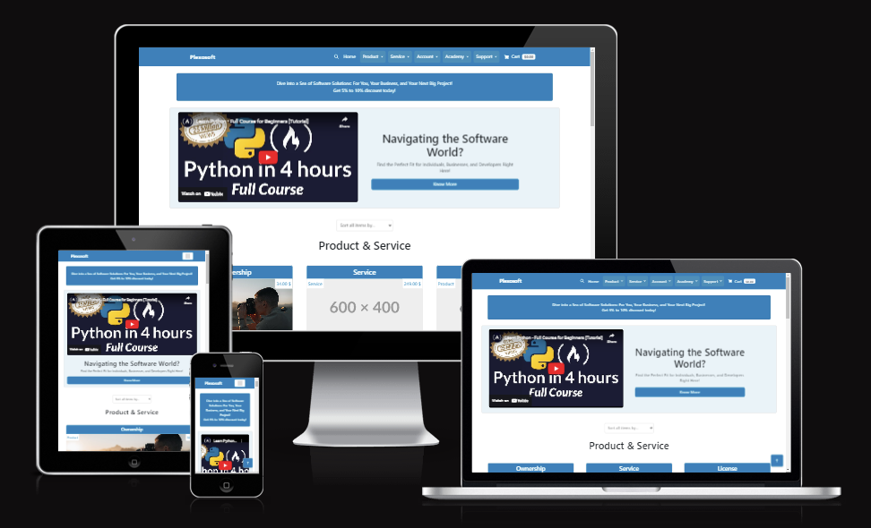

Welcome to Plexosoft, the best software marketplace for business where innovation meets user-centric design. We're not just a marketplace for software products; we're a comprehensive software licensing service connecting individuals, businesses, and developers with functional code for ownership or licensing. Whether you're looking for second-hand software, Python-made websites, or a perpetual license to software as a service, our mission is rooted in clarity, transparency, and inclusivity.

Join us on this exciting journey as we bridge the gap between software ownership and licensing. With Plexosoft, you can buy software with license online, or even opt for a software ownership service. We prioritize user privacy and security, offer diverse payment options, and embrace culturally relevant designs. Our holistic approach means we're not just about code; we're about building trust and fostering powerful software for websites, complete with website support services.

Explore Plexosoft and discover a world of software possibilities designed with you in mind. From customizable software applications to multilingual software websites developed by Python expert website developers, there’s something for everyone. Stay tuned for updates on our exciting journey from blueprint to reality, and find out how we can offer support for your website idea via email. Whether you're looking to fix website issues, buy custom software development, or explore software ideas for projects, Plexosoft is the place to be.

**Key Features:**

- Digital Downloads
- Stripe Payments
- User & Guest Checkout
- User & Admin Dashboard
- AWS S3
- Newsletter (Mailchimp)
- Contact Page
- FAQ Page