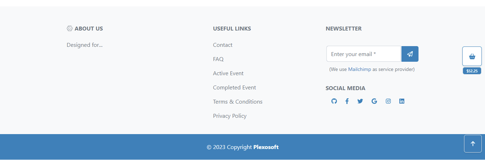

### Facebook
We have created a Facebook page accessible from the main footer of the site. We plan to use it for our client base and potentially for paid ads in the future. After several releases and a consistent client base, we will explore organic social media marketing on Facebook and other social media networks when it's appropriate.

- To create a Facebook Page we have followed these steps:

??? info "How to create a Facebook Page (2023)"

    Follow these steps to create a Facebook Page for your business or organization:

    1. **Log In to Facebook:**
    If you don't have a Facebook account, you'll need to create one. Log in to your existing account or sign up for a new one.

    2. **Go to Facebook's Create Page:** Visit [Facebook's Create a Page](https://www.facebook.com/pages/creation/) page.

    3. **Collect important data about your business first:**
        - All marketing data will be important to fill the following form fields.

    4. **Enter Page Details:**
        - Add your Page Name.
        - Select a Category that best describes your page.
        - Add a bio.
        - Add a profile picture (usually a logo or image associated with your business).
        - Add a cover photo that represents your page (this can be a banner or promotional image).

    5. **Customize Your Page:**
        - Fill in the "About" section with a brief description of your business or page.
        - Add your website URL if applicable.
        - Configure other optional settings, such as username, which creates a custom URL for your page (e.g., `facebook.com/YourPageName`) from [Custom URL](https://www.facebook.com/settings/?tab=profile).

    6. **Create Your First Post:**
        - Share an initial post to engage your audience. This can be a welcome message, announcement, or any relevant content.

    7. **Invite Friends and Promote Your Page:**
        - Invite your Facebook friends to like your page.
        - Promote your page through other marketing channels.

    8. **Explore Page Settings:**
        - Click on "Settings" at the top right of your page to access various customization and management options.
        - Adjust privacy settings, page roles, and more according to your needs.

    9. **Start Posting Regularly:**
        - Share updates, content, and engage with your audience regularly to build your online presence.

    10. **Consider Paid Promotion:**
        - If you're ready to invest, you can create paid Facebook ads to reach a broader audience.

    Congratulations! You've successfully created a Facebook Page for your business or organization. Keep it updated and interact with your audience to grow your online community.

#### Footer Access
As a user, you can scroll down to the end of the page to find our powerful footer. There, you will see our Facebook icon that will redirect you to our Facebook page.

??? info "Footer Image"
    

#### Facebook Page

Our current Facebook page is for demonstration purposes only, although we have reserved our custom URL for future use.

- [Visit Facebook Page](https://www.facebook.com/plexosoft)
??? info "Facebook Page Image"
    

### Content Marketing
For this iteration, we have chosen not to proceed with the blog or academy section.

### Email Marketing

For email marketing, we have implemented Mailchimp. We adapted the code they provided to our own in order to maintain the overall design consistency. We have also integrated Mailchimp's pop-up newsletter module.

The forms are unique because it triggers actions in both Mailchimp and our own code. We store the emails in Mailchimp and also back them up in our database for future use.

We collect these emails for our email marketing campaigns, where we plan to send offers and updates.

### Newsletter

We have implemented a Mailchimp-based newsletter that appears in various locations: within our product and service instances, in the footer, and in a pop-up model that appears when users attempt to leave the page. As seen here:

??? info "Footer Newsletter Signup Form"
    

??? info "Instance Newsletter Signup Form"
    

### SEO Criteria

We have used the following criteria for our SEO implementation:
??? info "SEO Semantic"
    #### 1. Utilizing Semantic HTML for Improved Searchability

    - **Header and Nav**: Employing `<header>` and `<nav>` tags to define the website's top navigation and bring structure to the layout.
    - **Article, Section, and Footer**: Using `<article>`, `<section>`, and `<footer>` elements to categorize content, which helps search engines understand the content's hierarchy and importance.
    - **Aside**: Implementing the `<aside>` tag to specify content that is tangentially related to the main content, such as ads or side notes.
    - **H1 - H6 Headings**: Strategically utilizing header tags (from `<h1>` to `<h6>`) to highlight important content and improve page structure.
    - **Strong and Em**: Leveraging `<strong>` and `<em>` tags to emphasize keywords and important phrases.

    #### 2. SEO Smart Content Creation and Optimization

    Write and rewrite website content with a focus on integrating SEO Smart Keywords. The aim is to make the content search-engine-friendly without compromising readability and user experience.

    #### 3. Effective Use of Anchor Tags

    - **Internal Links Without `noopener` and `noreferrer`**: For internal linking, avoid using these attributes to maintain session continuity.
    - **External Links With `noopener` and `noreferrer`**: For external links, especially those that open in a new tab, use these attributes for security reasons.
    - **Selective Use of External Links Without `noopener` and `noreferrer`**: For high-quality, related content, these attributes may be omitted to pass link equity.
    - **Keyword-Rich Link Text and ARIA Attributes**: Use keywords in the anchor text and `aria-label` attributes to provide context and improve accessibility.

    #### 4. Alt Attributes for Images

    - **SEO Smart Keywords**: Include these in the `alt` text to enhance image search results.
    - **Descriptive Alt Text**: Make sure the `alt` text describes the image's content and function, especially if the image contains information or serves a specific purpose like a CTA button.

    #### 5. Metadata in the Head Tag for Enhanced Search Engine Recognition

    - **Title**: Craft a compelling and keyword-rich title that effectively represents the webpage content.
    - **Description**: Write a succinct yet descriptive meta description that includes SEO Smart Keywords.
    - **Keywords**: Stack short-tail and long-tail SEO Smart Keywords to cover various search queries.
    - **Author**: Attribute the content to the author for additional metadata richness.

??? info "Sitemap & Robots"
    ### 6. Sitemaps and Robots.txt for Search Engine Crawling

    Our `sitemap.xml` and `robots.txt`can be found on our project's main directory.

    #### Sitemaps
    - **Generating Sitemaps**: Utilize XML Sitemap generators like [XML-Sitemaps](https://www.xml-sitemaps.com/) to create a sitemap for your website.
    - **Submission to Google**: Follow guidelines on how to build and submit a sitemap to Google as outlined in their [official documentation](https://developers.google.com/search/docs/advanced/sitemaps/build-sitemap).

    #### Robots.txt
    - **Creating Robots.txt**: This file guides search engine bots on what parts of the website should or shouldn't be crawled and indexed.
    - **Robots.txt Guidelines**: Consult [Google's support guide](https://support.google.com/webmasters/answer/7451001) for best practices on setting up your robots.txt file.

    #### Submission to Google
    - **Google Search Console**: Submit your sitemap and robots.txt files to [Google's Search Console](https://search.google.com/search-console/) for better indexation.
    - **Additional Guidance**: For further reading on the submission process, check out [Google's support documentation](https://support.google.com/webmasters/answer/6062598?hl=en).

??? info "SEO Smart Keywords"
    ### SEO Keywords Plan
    Our SEO keywords plan can be found here [SEO Plan](../../design/user-centric/strategy/strategy.md/#seo-plan)

