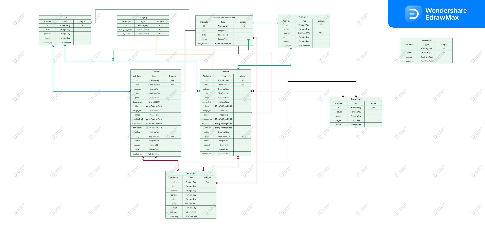

## Entity Relationship Diagram (ERD)

During our [Ideation Process](../design-thinking/ideate/ideate.md/?h=database#database), as anticipated, we chose the following Database Model:

???+ tip "Plexosoft Database Model"
    - Product
    - Service
    - Category
    - Abstract User
    - Transaction
    - Download
    - Like
    - Comment
    - Newsletter

The principle of separation of concerns might seem self-explanatory, but ensuring organized data while respecting its integrity is pivotal. This approach not only facilitates future project scalability but also simplifies the development process.

## Diagram

- [Live Version](https://www.edrawmax.com/online/share.html?code=de920716472111ee8de00a951ba8b83d)

??? abstract "Diagram Image"
    

## Table Model
### UserProfile Model
??? abstract "UserProfile Model"

    | Attribute         | Type             | Unique  | Relationship  | Model Linked To                            |
    |-------------------|------------------|---------|---------------|-------------------------------------------|
    | role              | IntegerField     | -       | -             | -                                         |
    | type              | IntegerField     | -       | -             | -                                         |
    | status            | IntegerField     | -       | -             | -                                         |
    | user_transactions | **ManyToManyField** | -    | Many to many  | Product Model through Transaction Model    |

### Comment Model
??? abstract "Comment Model"
    | Attribute     | Type              | Unique  | Relationship  | Model Linked To                 |
    |---------------|-------------------|---------|---------------|--------------------------------|
    | writer        | **ForeignKey**    | -       | Many to one   | UserProfile Model               |
    | comment       | TextField(256)    | Yes     | -             | -                              |
    | product       | **ForeignKey**    | -       | Many to one   | Product Model                  |
    | service       | **ForeignKey**    | -       | Many to one   | Service Model                  |
    | created_on    | DateTimeField         | -       | -             | -                              |

### Like Model
??? abstract "Like Model"

    | Attribute     | Type              | Unique  | Relationship  | Model Linked To                 |
    |---------------|-------------------|---------|---------------|--------------------------------|
    | liker         | **ForeignKey**    | -       | Many to one   | UserProfile Model               |
    | product       | **ForeignKey**    | -       | Many to one   | Product Model                  |
    | service       | **ForeignKey**    | -       | Many to one   | Service Model                  |
    | created_on    | DateTimeField         | -       | -             | -                              |

### NewsLetter Model
??? abstract "NewsLetter Model"

    | Attribute     | Type              | Unique  | Relationship  | Model Linked To                 |
    |---------------|-------------------|---------|---------------|--------------------------------|
    | email         | EmailField        | Yes     | -             | -                              |
    | excerpt       | CharField(128)    | -       | -             | -                              |
    | created_on    | DateTimeField         | -       | -             | -                              |

### CodeType Model
??? abstract "CodeType Model"

    | Attribute      | Type            | Unique | Relationship | Model Linked To |
    |----------------|-----------------|--------|--------------|-----------------|
    | code           | CharField(64)   | Yes    | -            | -               |

### ServiceType Model
??? abstract "ServiceType Model"

    | Attribute      | Type            | Unique | Relationship | Model Linked To |
    |----------------|-----------------|--------|--------------|-----------------|
    | service        | CharField(64)   | Yes    | -            | -               |

### Category Model
??? abstract "Category Model"

    | Attribute      | Type            | Unique | Relationship | Model Linked To |
    |----------------|-----------------|--------|--------------|-----------------|
    | category_name  | CharField(64)   | Yes    | -            | -               |
    | alt_name       | CharField(64)   | Yes    | -            | -               |

### Product Model
??? abstract "Product Model"

    | Attribute       | Type                   | Unique  | Relationship      | Model Linked To                          |
    |-----------------|------------------------|---------|-------------------|------------------------------------------|
    | title           | CharField(64)          | Yes     | -                 | -                                        |
    | sku             | CharField(64)          | Yes     | -                 | -                                        |
    | price           | DecimalField           | -       | -                 | -                                        |
    | description     | TextField(256)         | -       | -                 | -                                        |
    | status          | IntegerField           | -       | -                 | -                                        |
    | category        | **ForeignKey**         | -       | Many to one       | Category Model                           |
    | excerpt         | CharField(128)         | -       | -                 | -                                        |
    | type            | IntegerField           | -       | -                 | 
    -                                        |
    | code            | **ManyToManyField**    | -     | Many to many    | CodeType
    -                                        |
    | service         | **ManyToManyField**    | -     | Many to many    | CodeType
    -                                        |
    | preview         | URLField(1024)       | -         | -                 | 
    -                                        |
    | docs            | URLField(1024)       | -         | -                 | 
    -                                        |
    | slug            | SlugField(200)         | Yes     | -                 | -                                        |
    | image           | ImageField             | -       | -                 | -                                        |
    | image_url       | URLField(1024)         | -       | -                 | -                                        |
    | author          | **ForeignKey**         | -       | Many to one       | UserProfile Model                        |
    | created_on      | DateTimeField              | -       | -                 | -                                        |
    | likes           | **ManyToManyField**    | -       | Many to many      | Like Model                               |
    | comments        | **ManyToManyField**    | -       | Many to many      | Comment Model                            |
    | transactions    | **ManyToManyField**    | -       | Many to many      | UserProfile Model through Transaction Model |
    | download_url    | **ManyToManyField**    | -       | Many to many      | Download Model                           |

### Service Model
??? abstract "Service Model"

    | Attribute       | Type                   | Unique  | Relationship      | Model Linked To                          |
    |-----------------|------------------------|---------|-------------------|------------------------------------------|
    | (Same fields as the Product Model, subject to scalability in the future)        |         |                   |                                          |

### Download Model
??? abstract "Download Model"

    | Attribute      | Type            | Unique | Relationship | Model Linked To             |
    |----------------|-----------------|--------|--------------|-----------------------------|
    | product        | **ForeignKey**  | -      | Many to one  | Product Model               |
    | service        | **ForeignKey**  | -      | Many to one  | Service Model               |
    | file_url       | URLField(1024)  | -      | -            | -                           |
    | status         | IntegerField    | -      | -            | -                           |

### Transaction Model
??? abstract "Transaction Model"

    | Attribute      | Type            | Unique | Relationship | Model Linked To             |
    |----------------|-----------------|--------|--------------|-----------------------------|
    | buyer          | **ForeignKey**  | -      | Many to one  | UserProfile Model           |
    | product        | **ForeignKey**  | -      | Many to one  | Product Model               |
    | service        | **ForeignKey**  | -      | Many to one  | Service Model               |
    | sku            | CharField(64)   | -      | -            | -                           |
    | price          | DecimalField    | -      | -            | -                           |
    | paid           | DecimalField    | -      | -            | -                           |
    | item_url       | URLField(1024)  | -      | -            | -                           |
    | gateway        | IntegerField    | -      | -            | -                           |
    | timestamp      | DateTimeField   | -      | -            | -                           |


## Developer Experience

- Since we are using the abstract user we had to add our changes into our settings.py:
    ```py
    AUTH_USER_MODEL = 'homepage.UserProfile'
    ```
