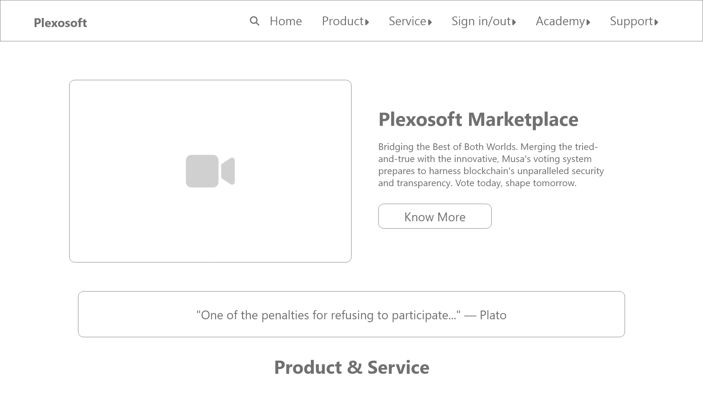
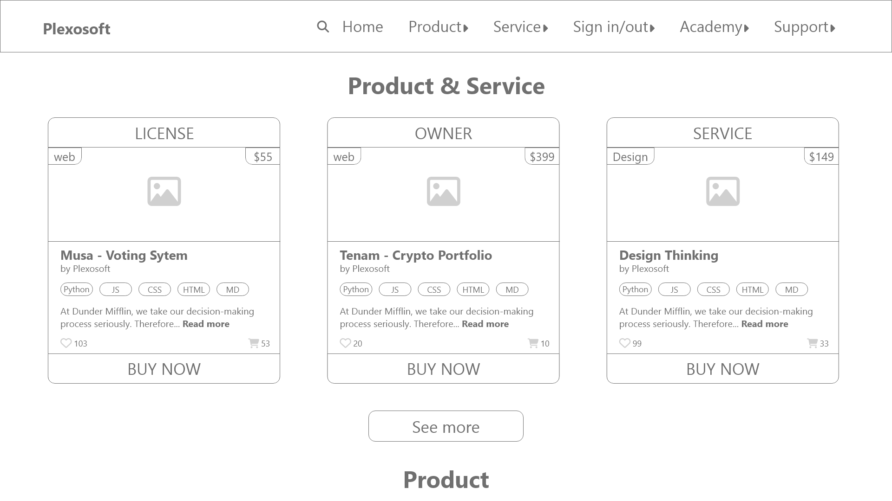
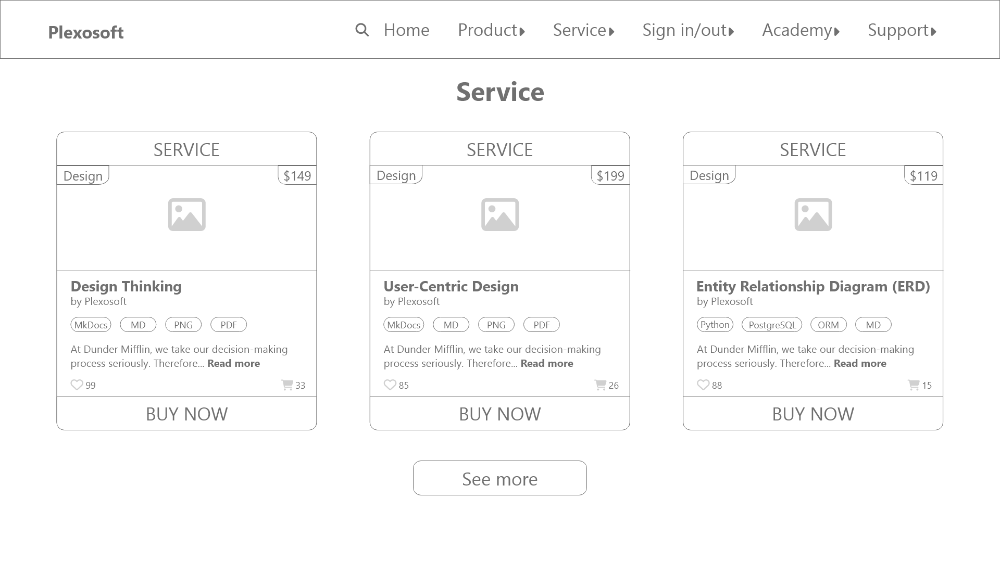
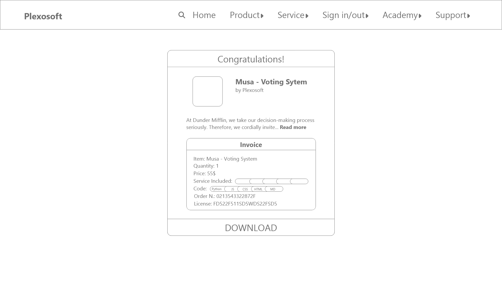
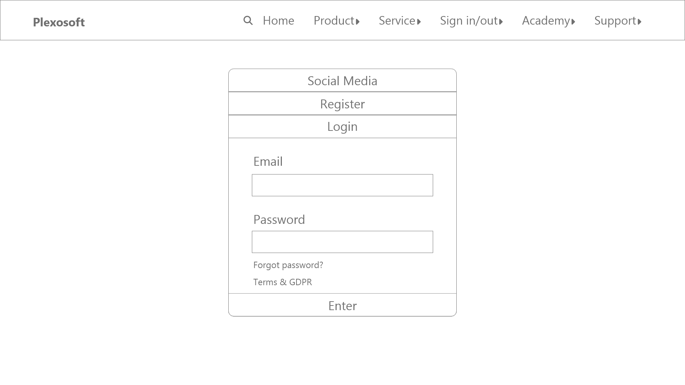
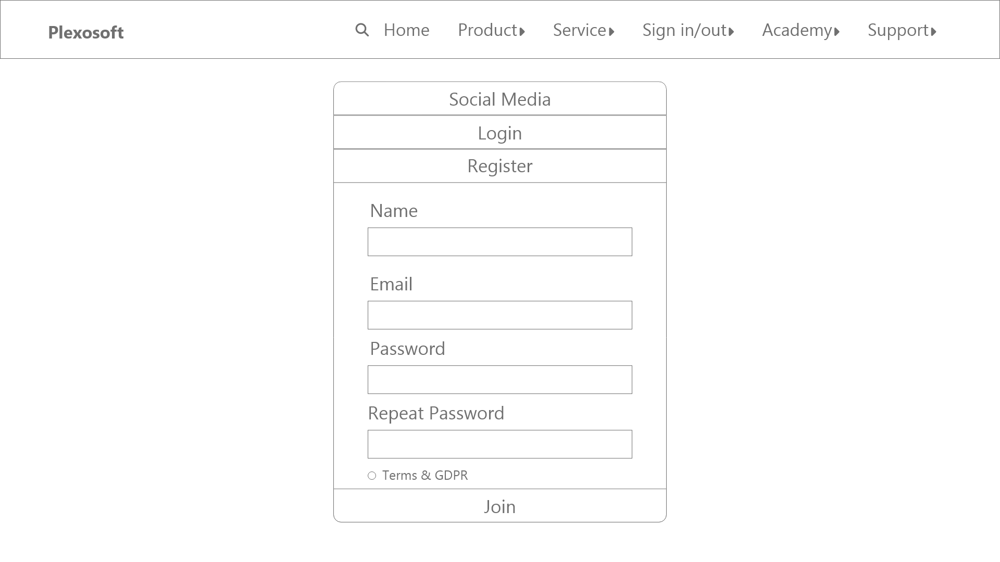
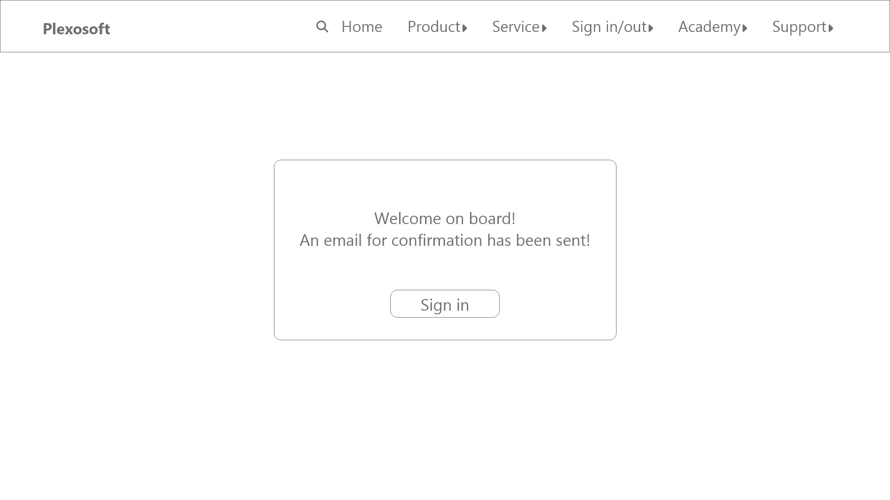

## Skeleton Plane - Layout, Interaction and Relationship

Our meticulous approach to this project has been instrumental in building a captivating and insightful prototype. Every idea and requirement for this iteration was seamlessly integrated.

While we recognize that the final product might differ slightly, a prototype serves as an invaluable starting point. It becomes our primary reference, facilitating immediate visual feedback and rapid adjustments.

Our development trajectory has followed a logical sequence: **Strategy**, **Scope**, **Structure**, and we are now transitioning to the **Skeleton** phase.

Up to this point, our concepts might have existed in somewhat nebulous forms, perhaps as isolated sketches without a clear connection. Yet, during the **Skeleton** plane, the essence of our project becomes palpable. We gain a heightened perspective that allows us to see the project holistically, an advantage that proves invaluable during the coding phase.

In this stage, all **features**, **functionalities**, **interactive elements**, and **content layouts** are clearly delineated. The intricate weave of interconnected components, which we've painstakingly crafted, is evident.

For this plane, we've chosen to use **Adobe XD**, a tool with which the author is intimately familiar. It provides an exhaustive **wireframe** that streamlines our process, fostering efficient collaboration.

## Prototype GIF & Images

Although we didn't create a prototype for every feature due to the project's extensive scope, we've outlined the most critical features and layouts that will be extended throughout the project. Our design, intentions, and ideas are accurately reflected in this prototype, crafted using **AdobeXD**.

??? example "Prototype GIF"
    

??? example "Homepage"
    
    
    
    
    

??? example "Dedicated Page"
    
    

??? example "Login & Register"
    
    
    

??? example "FAQ & Contact"
    
    

??? example "See More Page"
    

## Conclusion
- The design is user-friendly and features straightforward navigation. This approach ensures that all essential functions are within a few clicks from the user's goal.

- In the header, there's a search button activated upon clicking. As illustrated in the images, the menu boasts several dropdown options for enhanced navigation and precise searches.

- The content and functionality hierarchy is well-defined: The Homepage is prioritized, showcasing Product & Service cards along with additional information. Following this, there's the specific product/service page as expected. Then, users can choose to either Login/Register or explore the Support dropdown section.

- We've designed a logical progression from basic to more intricate functionalities and layouts. As users navigate the website, they are guided, allowing them to learn organically. We prioritize not overwhelming our users, adhering firmly to the principle of **progressive disclosure**.

- Significant time and resources were invested in this phase, all before initiating coding, emphasizing detailed planning.

- Our design approach emphasizes familiarity. Every element is intuitively designed, reflecting our understanding of user behaviors, established standards, and conventions.

- We meticulously addressed elements such as keywords, hidden metadata, content hierarchies, and the layout of lists and forms. These components are prominently showcased in our **desktop-based prototype/demo**.

Throughout the design process, our primary objectives were simplicity, intuition, and consistency. Simultaneously, we prepared for our final stage, defining essential design elements like colors and shapes. Our next focus is the **Surface plane**.