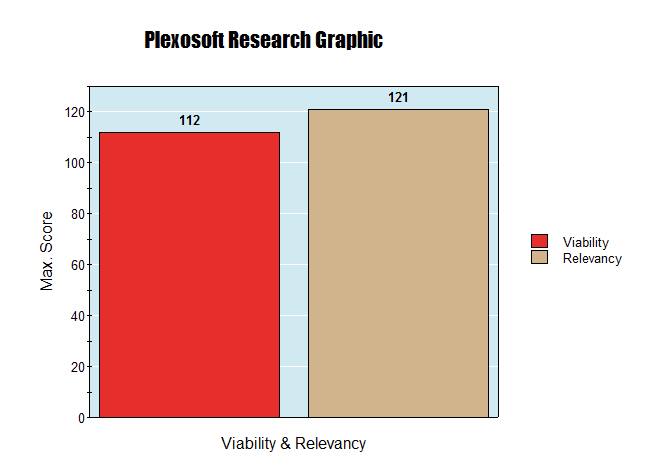
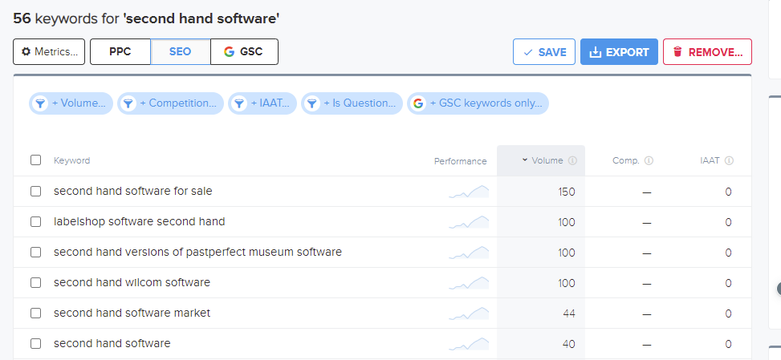
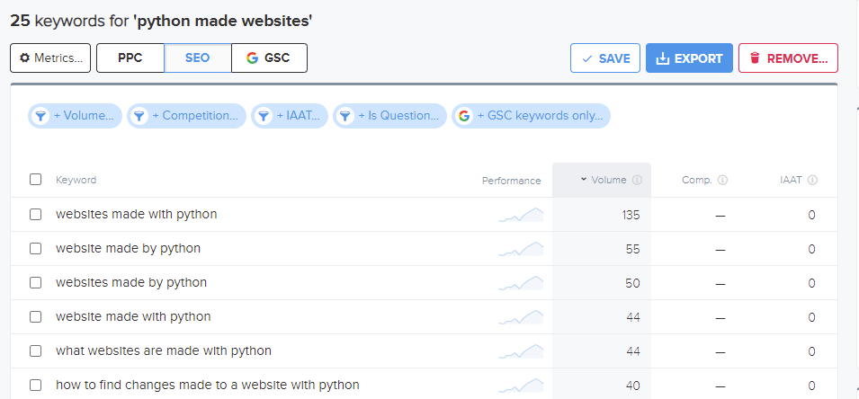
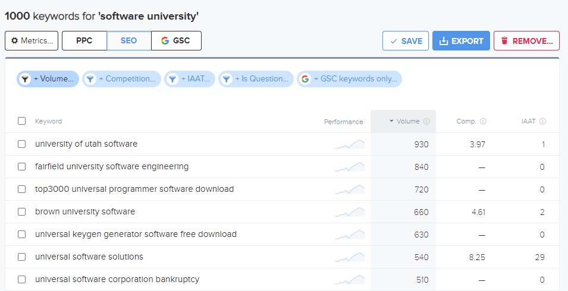
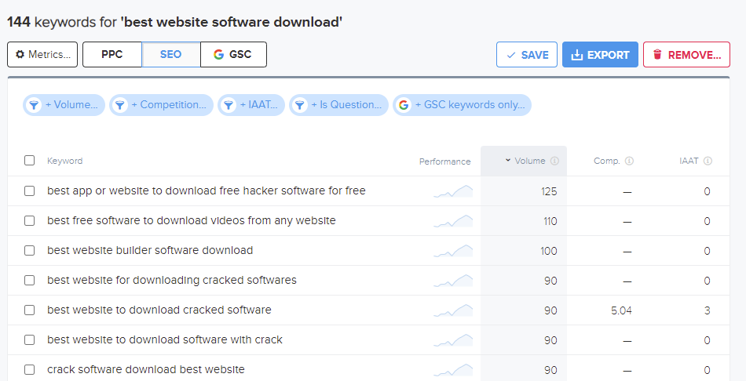
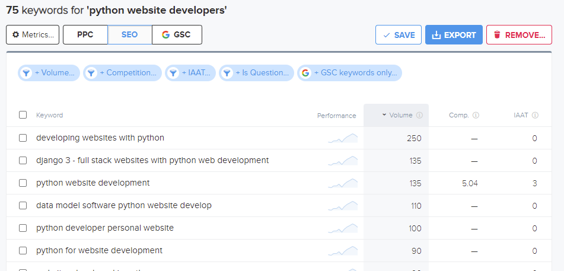
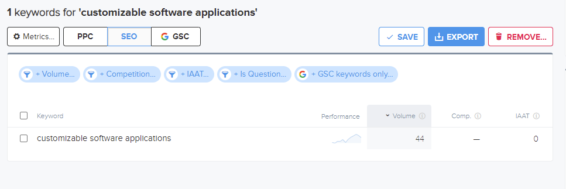
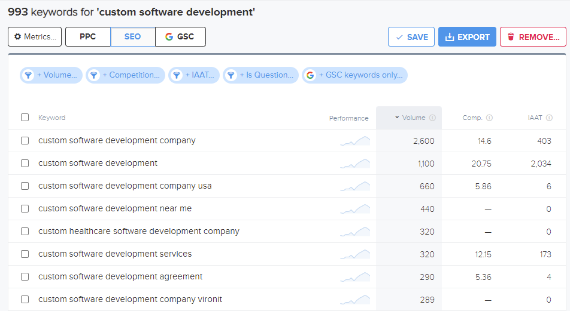

## Strategy Plane - Reason, Solution, and Value

In this phase, we analyze the data obtained from conducting 4 different interviews with individuals from diverse backgrounds. This time we included the author's opinions. These interviews have provided valuable insights into the general and specific aspects of a **Software Marketplace**.

Based on our findings from the **Design Thinking** process, we have reached the following conclusions, which will serve as our official source of information for Plexosoft's MVP:

- Although our users may not have had a complete understanding of their needs, we made every effort to comprehend their requirements and propose the best possible solutions.

- Recognizing that users are the key stakeholders, our primary focus is to create a platform that benefits both business professionals and future users.

- ??? info "Critical Concerns"
    - Clear Product & Service Descriptions.
    - Transparency, Trust-enhancing, Privacy & Security.
    - Solutions, Customization,  Distinct Offerings & Extended Services.
    - Affordability, Presentation, Accessibility & Performance.
    - Education, Inclusion, Opportunities, Peers Endorsement & User Reviews. 

To address these issues, we will tackle specific problems and fulfill their desires, enabling them to thrive within the ecosystem. For this iteration, we have identified the following core technologies to utilize:

- ??? info "Core Technologies"
    - Django
    - JQuery
    - Bootstrap
    - PostgreSQL
    - psycopg2
    - SQLAlchemy
    - Font Awesome
    - Lottie Files
    - Social Media Login
    - Stripe
    - Mailchimp (Newsletter)
    - Google Analytics
    - RSS
    - Allauth
    - AWS S3
    - EmailJS
    - Vendor-specific Templates

To address individual issues, tasks, or desires, please refer to the following resources (Design Thinking):

- [Conclusion](../../design-thinking/conclusion/conclusion.md)
- [Prototype](../../design-thinking/PoC/poc.md)

Our insights are grounded in sufficient research, supported by the accompanying table and graphic:

- From this table, we can extract the themes, epics, and potential ideas for user stories.

### Research Table

| Goals                                         | Relevancy (0-5) | Viability (0-5) | N. Items (0-~) |
| --------------------------------------------- | --------------- | --------------- | -------------- |
| Display Products & Labels on Homepage         | 5               | 5               | 1              |
| Search Bar & Filtering                        | 5               | 4               | 1              |
| Menu & Dropdowns                              | 5               | 5               | 1              |
| Product & Service Page                        | 5               | 5               | 1              |
| Sign in/up option                             | 5               | 5               | 1              |
| Social Media Login                            | 5               | 3               | 1              |
| Email Verification                            | 5               | 4               | 1              |
| Abstract User (roles, etc.)                   | 5               | 5               | 1              |
| User Feedback                                 | 5               | 5               | 1              |
| Metrics                                       | 5               | 5               | 1              |
| Reviews & Comments                            | 5               | 4               | 1              |
| Cart, Purchase & Download                     | 5               | 4               | 1              |
| User & Admin Dashboard                        | 5               | 4               | 1              |
| Support Button                                | 5               | 4               | 1              |
| Contact Form                                  | 5               | 4               | 1              |
| Request Formats                               | 3               | 4               | 1              |
| FAQ                                           | 4               | 4               | 1              |
| Newsletter                                    | 5               | 4               | 1              |
| RSS                                           | 3               | 4               | 1              |
| Caching                                       | 5               | 4               | 1              |
| Google Analytics                              | 4               | 4               | 1              |
| AWS S3                                        | 5               | 4               | 1              |
| EmailJS                                       | 4               | 4               | 1              |
| Lottie Files                                  | 3               | 5               | 1              |
| Terms of Service & Privacy Policy (GDPR)      | 5               | 4               | 1              |
| Database Model                                | 5               | 5               | 1              |
| N. Items                                      |                 |                 | 26             |
| Max. Points                                   |                 |                 | 130            |
| Results                                       | 121             | 112             |                |
| Percentage                                    | 93.07% (Strategy) | 86.15% (Scope) |               |

We've conducted an estimation based on our experience, and we are pleasantly surprised by the `design thinking` results. The decisions about which features to implement felt grounded in real factors and user needs, rather than personal assumptions or ideas:

- As indicated in the table and the graphic, most of the features have high relevancy for this iteration. An exception is the {==Request Formats==} feature, which received a '3' for relevancy and '4' for viability. the same for {==RSS==} and {==Lottie Files==} with '3' and '5' respectevely. These features could take various forms, and its style and functionality is subject to continuous changes to improve the user experience.

- Looking at the viability column, the most important features range from 4 to 5, which isn't a significant difference. This slight variation represents our ability to fulfill potential requirements within our time and resource constraints. The lowest score was {==Social Media Login==} with '3' due to the fact that this is an MVP and to be accepted by Google or Facebook may require extra features and formalities.

- Despite being powerful features, their full implementation might be constrained by our limited resources and time. However, we will strive to add functional aspects for each to meet the Minimum Viable Product (MVP) requirements.

We should highlight that achieving most of the features described above doesn't necessarily mean they are all perfect or that the development process has come to an end. On the contrary, this MVP is the foundation for a much more robust and reliable software marketplace.

### Research Graphic

- **Relevancy**: As seen from the research graphic, there is a difference of '9' points between the maximum point value of '130' and the relevancy results. This suggests that we might be omitting almost the amount of 2 features, with each feature being 5 points, due to a lack of relevancy or the partial development of some features.

- **Viability**: As observed from the research graphic, there's a difference of '18' points between the maximum point value of '130' and the viability results. This indicates that we might be developing almost the amount of 3.6 features partially, with each feature being 5 points, due to a lack of viability.

- **Conclusion**: From the research graphic, there's a difference of '9' points between the relevancy and viability sections. This implies that roughly 2 features might be partially developed or that some features might not be fully completed due to constraints in resources and time. A gap of '9' isn't substantial, representing only a 7.43% impact on all crucial features. This indicates that most of our desired features for our MVP are entirely achievable.

## E-commerce App Blueprint

| # | Category                       | Details                                                                                             |
|---|--------------------------------|-----------------------------------------------------------------------------------------------------|
| 1 | **Target Audience - Who**      | - Primarily B2C (Business to Consumer)   - B2B (Business to Business) - Possible with further expansion and customization |
| 2 | **Offerings - What**           | - Digital Products   - Services                                                                  |
| 3 | **Payment Methods - How**      | - One-time Payment                                                                                  |
| 4 | **Key Features & Information Display** | - Refer to the above section for details.                                                        |
| 5 | **Essential Data Tables**      | - Product   - Category   - Abstract User   - Transaction   - Download   - Review   - Newsletter            |

## SEO Plan

### STEP 1: Identification of Relevant Topics
Based on our existing knowledge of our business, we've compiled a list of general topics. This will help us rank prominently in search results. To understand our target keywords better, consider the personas: what topics or keywords would our potential customers likely search for?

- Software Marketplace

- Buy Your Own Software to Create a Website

- Buy Software with License and Support

- Buy Customizable Software

### STEP 2: Brain Dump Possible Keywords for each of the Relevant Topics

Below is a table that breaks down the main titles and their associated long-tail (LT) and short-tail (ST) keywords:

??? abstract "Brain Dump Possible Keywords"

    | Relevant Topic                                            | Short-Tail Keywords (ST)                        | Long-Tail Keywords (LT)                                                     |
    |--------------------------------------------------------|-------------------------------------------------|----------------------------------------------------------------------------|
    | **Software Marketplace**                               | User-friendly software, fix bug website, python websites, Software Licensing, Software ownership | Best software marketplace, software marketplace with good support services, where to find websites made with python, buy software with licenses, Buy software for Ownership, Support Software Idea |
    | **Buy Your Own Software to Create a Website**         | Software AI, Software Blockchain, Software Community, Software Academy, Powerful Software, multilingual website | I need a website with AI, I need a software or website with Blockchain, Software Service with Community, Software Marketplace and academy to learn, powerful software for websites |
    | **Buy Software with License and Support**              | Software and license, website and license, support for website, fix bug website, expert team website, python expert website, multilingual software website | Where to buy software with license, where to buy a website with license, best support with software or website marketplace, developer to fix bug website, developer team for websites, find python expert for website creation |
    | **Buy Customizable Software**                          | Customizable Software, Customizable Marketplace Website, Ideas software, Ideas website, Affordable Software, Idea Support Website | Create website based on my idea, buy website in a marketplace, best software ideas for websites, affordable website to buy marketplace, best support for website creation, maintenance for website and software |

### STEP 3: Try Out On Google

We have added and removed keywords based on the results obtained from the following Google features:

- Autocomplete Feature
- People Also Ask
- Related Searches
- Titles from Similar Websites
- Descriptions from Similar Websites

??? abstract "Tried Out On Google"

    | Relevant Topic                                            | Short-Tail Keywords (ST)                        | Long-Tail Keywords (LT)                                                     |
    |--------------------------------------------------------|-------------------------------------------------|----------------------------------------------------------------------------|
    | **Software Marketplace**                               | second hand software, fix website bug, fix website bug online, python made websites, software licensing service, licensing as a service, software ownership service | saas software for sale, websites developed by using Python, best software marketplace for business, best marketplace to sell software, marketplace for software products, software marketplace with good support services saas, buy websites made with python+django, buy software with license online, best place to buy software with license, buy software for ownership online, who can help me build my website?, support for my website idea email, software ideas for project, how do I fix a bug on my website? |
    | **Buy Your Own Software to Create a Website**         | blockchain software download, software ai engineer, software ai tools, software blockchain projects, ai website design, community software group, software academy online, software university, best website software download, multilingual website service | make my website multilingual, software for blockchain development, can I create a website with AI?, how do I create a blockchain web application?, how can blockchain be used in business, community software platforms, what is a community software?, online community software platforms, software marketplace platform, b2b software marketplace, b2c software marketplace, powerful software for websites |
    | **Buy Software with License and Support**              | software license and service agreement, website support services, fix website issues, expert web developers, python expert website developers, multilingual software website | python expert website developers, does NASA use Python?, is Python good for web development?, website support and maintenance services, do you need a software license?, where to buy a website with license, marketplace for software products, best developer to fix bug website, web developer roles and responsibilities, find python expert for website creation online, how do I find and hire expert Python developers? |
    | **Buy Customizable Software**                          | customizable software applications, custom software development, customizable marketplace website template, best marketplace website builder, ideas software development, ideas website design, cheap software licenses, buy website marketplace | best website to buy software online, affordable software for business, where to get programming ideas?, how do you develop software ideas?, how do I create a custom marketplace?, how do I get ideas for a website design?, software project ideas for students, software engineering projects ideas, what if I have an idea for a website?, can I build a website on my own?, create website based on my idea online, create website based on my idea app, how much does it cost to build a marketplace website, local buy and sell websites, where to buy an established website?, how much does it cost to set up a marketplace?, online software marketplace germany, web application ideas for students, best online software marketplace platform, online buying and selling sites, website design services near me, best website builder software |

### STEP 4: Keyword Selection Based on RAV/C

We've adjusted our keywords according to RAV/C:

- **Relevance:** Does our app fulfill the requirement?
- **Authority:** Are we genuinely addressing this topic? Do we provide that value?
- **Volume & Competition:** Do we face low volume, high volume, high competition, or low competition? Ideally, we aim for high volume and low competition.

???+ tip
    Consistently monitor keywords that repeatedly appear organically throughout this SEO plan, as they'll be crucial for subsequent phases. For tracking, consider utilizing:

    - [wordtracker.com](https://www.wordtracker.com/)
    - [Google Keyword Planner](https://ads.google.com/home/tools/keyword-planner/) 

The table has been rearranged to put the most relevant keywords up front for each topic. This enhances clarity and aligns the keywords more closely with their associated main topic. It is ready for the **final result** process.

??? abstract "Keyword Selection Based on RAV/C (Rearranged)"

    | Relevant Topic                                            | Short-Tail Keywords (ST)                        | Long-Tail Keywords (LT)                                                     |
    |--------------------------------------------------------|-------------------------------------------------|----------------------------------------------------------------------------|
    | **Software Marketplace**                               | software licensing service, licensing as a service, software ownership service, python made websites, fix website bug, second hand software, fix website bug online | best software marketplace for business, marketplace for software products, best marketplace to sell software, saas software for sale, websites developed by using Python, software marketplace with good support services saas, buy websites made with python+django, buy software with license online, best place to buy software with license, buy software for ownership online, support for my website idea email, software ideas for project, how do I fix a bug on my website? |
    | **Buy Your Own Software to Create a Website**         | software ai engineer, software ai tools, blockchain software download, software blockchain projects, ai website design, community software group, software academy online, software university, multilingual website service, best website software download | can I create a website with AI?, how do I create a blockchain web application?, how can blockchain be used in business, make my website multilingual, software for blockchain development, community software platforms, what is a community software?, online community software platforms, software marketplace platform, b2b software marketplace, b2c software marketplace, powerful software for websites |
    | **Buy Software with License and Support**              | software license and service agreement, website support services, fix website issues, expert web developers, python expert website developers, multilingual software website | where to buy a website with license, does NASA use Python?, is Python good for web development?, website support and maintenance services, do you need a software license?, marketplace for software products, best developer to fix bug website, web developer roles and responsibilities, find python expert for website creation online, how do I find and hire expert Python developers? |
    | **Buy Customizable Software**                          | customizable software applications, custom software development, customizable marketplace website template, best marketplace website builder, ideas software development, ideas website design, cheap software licenses, buy website marketplace | best website to buy software online, affordable software for business, how do I create a custom marketplace?, how do you develop software ideas?, where to get programming ideas?, how do I get ideas for a website design?, software project ideas for students, software engineering projects ideas, create website based on my idea online, create website based on my idea app, how much does it cost to build a marketplace website, local buy and sell websites, where to buy an established website?, how much does it cost to set up a marketplace?, online software marketplace germany, web application ideas for students, best online software marketplace platform, online buying and selling sites, website design services near me, best website builder software |

#### Keywords on wordtracker.com

We have chosen 3 keywords from the rearranged table and used them on wordtracker.com. Thanks to that tool we were able to collect better long-tail & short-tail keywords and they were added to the **final table**; the others were added arbitrarily for future research.

- Results after using this tool:

??? abstract "Relevant Topic: Software Marketplace"
    | Relevant Topic                                            | Short-Tail Keywords (ST)                        | Long-Tail Keywords (LT)                                                     |
    |--------------------------------------------------------|-------------------------------------------------|----------------------------------------------------------------------------|
    | **Software Marketplace**                               | software licensing service, second hand software, python made websites | perpetual license to software as a service, second hand software for sale, websites made with python |

    
    
    

??? abstract "Relevant Topic: Buy Your Own Software to Create a Website"
    | Relevant Topic                                            | Short-Tail Keywords (ST)                        | Long-Tail Keywords (LT)                                                     |
    |--------------------------------------------------------|-------------------------------------------------|----------------------------------------------------------------------------|
    | **Buy Your Own Software to Create a Website**                               | community software group, software university, best website software download | community interactive social media private group software, universal software solutions, best website builder software download |

    
    
    

??? abstract "Relevant Topic: Buy Software with License and Support"
    | Relevant Topic                                            | Short-Tail Keywords (ST)                        | Long-Tail Keywords (LT)                                                     |
    |--------------------------------------------------------|-------------------------------------------------|----------------------------------------------------------------------------|
    | **Buy Software with License and Support**                               | software license and service agreement, website support services, python expert website developers | software development and license and services agreement, website maintenance and support services, developing websites with python |

    
    
    
    

??? abstract "Relevant Topic: Buy Customizable Software"
    | Relevant Topic                                            | Short-Tail Keywords (ST)                        | Long-Tail Keywords (LT)                                                     |
    |--------------------------------------------------------|-------------------------------------------------|----------------------------------------------------------------------------|
    | **Buy Customizable Software**                               | customizable software applications, custom software development, ideas software development, buy website marketplace, website buy sell marketplace | custom software development near me, software development ideas |

    
    
    

### STEP 5: Final Results
#### Final Table
Final table incorporating all results for this iteration. Words used & sourced from wordtracker.com are highlighted.

??? abstract "Final Table"

    | Relevant Topic                                            | Short-Tail Keywords (ST)                        | Long-Tail Keywords (LT)                                                     |
    |--------------------------------------------------------|-------------------------------------------------|----------------------------------------------------------------------------|
    | **Software Marketplace**                               | {==software licensing service, second hand software, python made websites==}, licensing as a service, software ownership service, fix website bug, fix website bug online | {==perpetual license to software as a service, second hand software for sale, websites made with python==}, best software marketplace for business, marketplace for software products, best marketplace to sell software, saas software for sale, websites developed by using Python, software marketplace with good support services saas, buy websites made with python+django, buy software with license online, best place to buy software with license, buy software for ownership online, support for my website idea email, software ideas for project, how do I fix a bug on my website? |
    | **Buy Your Own Software to Create a Website**         | {==community software group, software university, best website software download==}, multilingual website service | {==community interactive social media private group software, universal software solutions, best website builder software download==}, can I create a website with AI?, how do I create a blockchain web application?, how can blockchain be used in business, make my website multilingual, software for blockchain development, community software platforms, what is a community software?, online community software platforms, software marketplace platform, b2b software marketplace, b2c software marketplace, powerful software for websites |
    | **Buy Software with License and Support**              | {==software license and service agreement, website support services, python expert website developers==}, fix website issues, expert web developers, multilingual software website | {==software development and license and services agreement, website maintenance and support services, developing websites with python==}, where to buy a website with license, does NASA use Python?, is Python good for web development?, website support and maintenance services, do you need a software license?, marketplace for software products, best developer to fix bug website, web developer roles and responsibilities, find python expert for website creation online, how do I find and hire expert Python developers? |
    | **Buy Customizable Software**                          | {==customizable software applications, custom software development, ideas software development, buy website marketplace, website buy sell marketplace==}, customizable marketplace website template, best marketplace website builder, ideas website design, cheap software licenses | {==custom software development near me, software development ideas, software development project ideas==}, best website to buy software online, affordable software for business, how do I create a custom marketplace?, how do you develop software ideas?, where to get programming ideas?, how do I get ideas for a website design?, software project ideas for students, software engineering projects ideas, create website based on my idea online, create website based on my idea app, how much does it cost to build a marketplace website, local buy and sell websites, where to buy an established website?, how much does it cost to set up a marketplace?, online software marketplace germany, web application ideas for students, best online software marketplace platform, online buying and selling sites, website design services near me, best website builder software |

### Tech Implementations
To implement within our code
### Content Creation
Great content & importance

Armed with this information, we can now move to the next stage, which is defining the `scope` of our project.